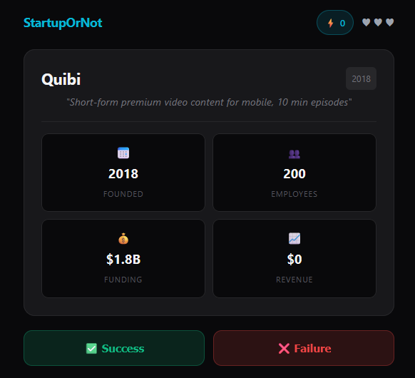

# StartupOrNot

A Wordle-like browser guessing game built to practice React, Express & Docker.
Card shows a startup [idea, funding, employees, and revenue] - user has to guess whether it succeeded or failed. 

---

## Tech stack

| Layer | Technology |
|---|---|
| Frontend | React 18 + Vite |
| Styling | Tailwind CSS |
| Backend | Node.js + Express |
| Database | PostgreSQL (Docker) |
| ORM | Prisma |

*Built as a learning project to get hands-on experience with React state, Prisma ORM, and Dockerized dbs.*
